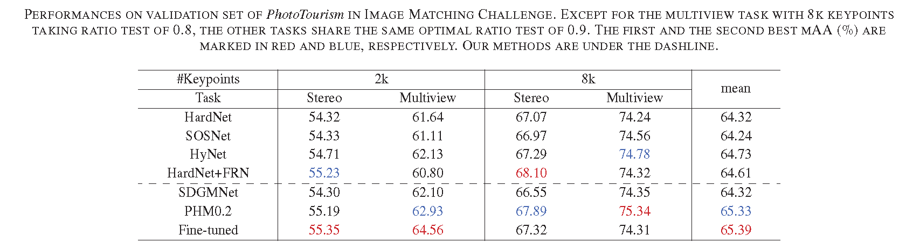

# SDGMNet
SDGMNet models in Pytorch for paper ["SDGMNet: Statistic-based Dynamic Gradient
Modulation for Local Descriptor Learning"](https://arxiv.org/abs/2106.04434).

# Training Code
```
python train.py --datadir='./UBC'
```

# Results on Image Matching Challenge


# Pre-trained models
Pre-trained models and loggers on UBC PhotoTour can be found in [pretrained](pretrained). State-of-the-art models trained on Liberty for Image matching challenge can be found in [pretrained/models/HPM0.2 PHM0.2](pretrained/models/HPM0.2).

# Losses
We implement several state-of-the-art [losses](losses.py) including SDGMNet, [SOSNet](https://github.com/yuruntian/SOSNet) and [HyNet](https://github.com/yuruntian/HyNet#hynet-learning-local-descriptor-with-hybrid-similarity-measure-and-triplet-loss).

# Citation
Please cite us if you use these models
```
@article{ma2021sdgmnet,
  title={SDGMNet: Statistic-based Dynamic Gradient Modulation for Local Descriptor Learning},
  author={Ma, Jiayi and Deng, Yuxin},
  journal={arXiv preprint arXiv:2106.04434},
  year={2021}
}
```
